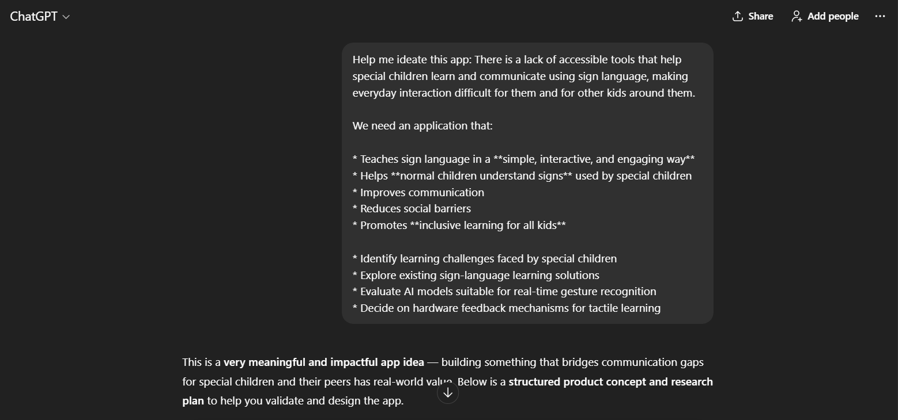
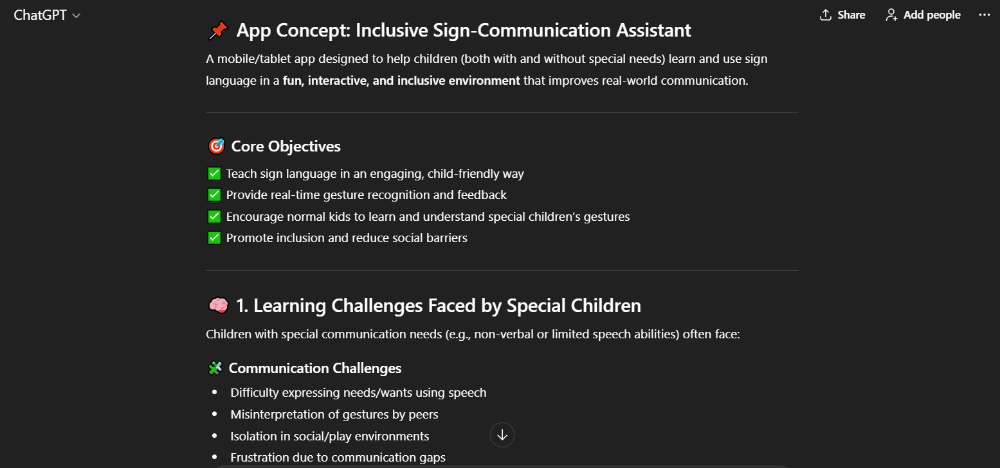
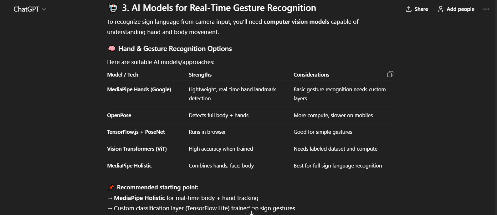
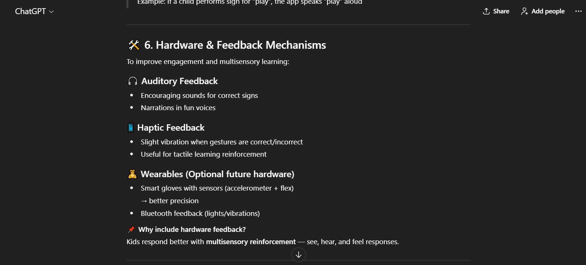
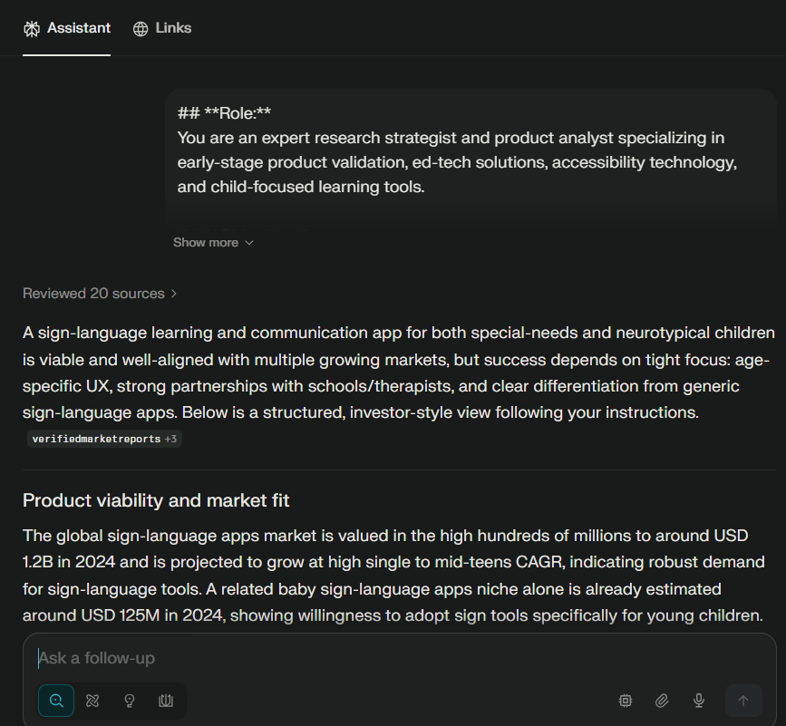
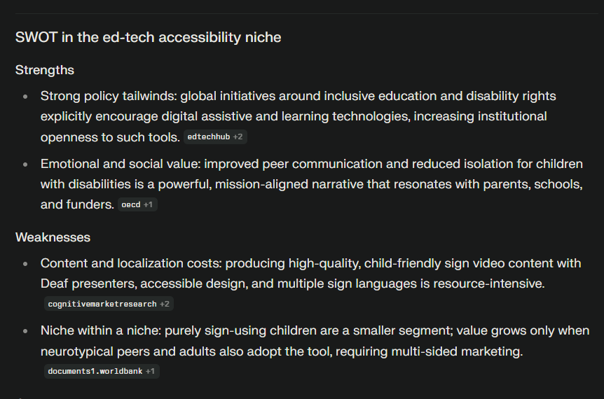
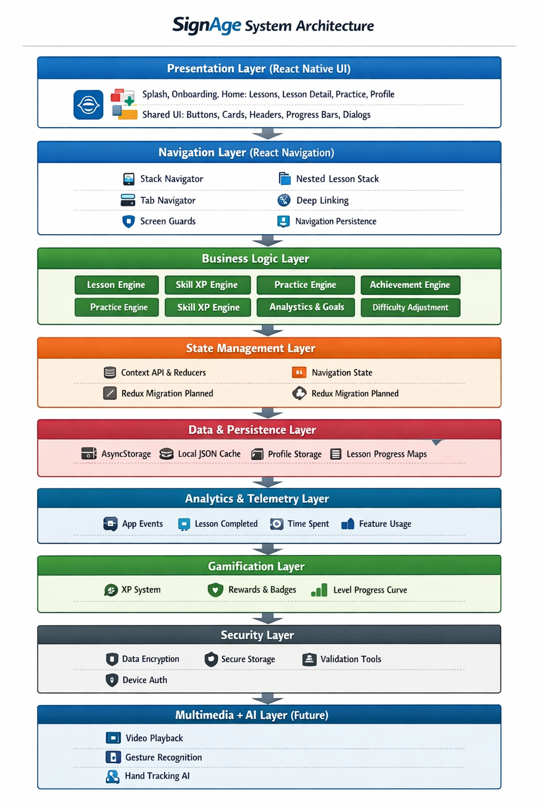

# SignAge – Inclusive Sign Language Learning Platform

SignAge is an AI-powered learning platform designed to **teach sign language in a simple, engaging way** and **bridge the communication gap between special children and normal children**.
The platform combines **computer vision, AI gesture recognition, web technologies, and optional hardware feedback** to create an inclusive learning environment.

---

## 📌 Problem Statement

There is a lack of accessible tools that help special children learn and communicate using sign language, making everyday interaction difficult for them and for other kids around them.

We need an application that:

* Teaches sign language in a **simple, interactive, and engaging way**
* Helps **normal children understand signs** used by special children
* Improves communication
* Reduces social barriers
* Promotes **inclusive learning for all kids**

---

## 💡 Ideation & Research (AI-Assisted)

We conducted ideation and research using AI tools to:

* Identify learning challenges faced by special children
* Explore existing sign-language learning solutions
* Evaluate AI models suitable for real-time gesture recognition
* Decide on hardware feedback mechanisms for tactile learning

### 🔍 Ideation Snapshots

| | |
|-----------|------------|
|  |  |
|  |  |

---

### 📊 Research Snapshots

| | |
|-----------|------------|
|  |  |

---

## 💼 Business Model

### 🎯 Target Users

* Special children learning sign language
* Normal children learning inclusive communication
* Schools & special education institutes
* Parents and educators

### 💰 Value Proposition

* Easy-to-understand sign language learning
* AI-powered gesture validation
* Optional hardware-based tactile feedback
* Inclusive and accessible education

### 💵 Monetization Strategy

* Freemium model (basic lessons free)
* Premium lesson packs
* School & institutional licensing
* Future hardware kits (ESP32 + vibration module)

---

## 🏗️ System Architecture

SignAge follows a **modular client–server architecture** with AI and optional hardware integration.

### 🧠 High-Level Flow

```
User Camera
   ↓
Image Capture (Frontend)
   ↓
Backend API
   ↓
MediaPipe Hands (Pretrained Model)
   ↓
Hand Landmarks
   ↓
Custom Gesture Logic Module
   ↓
Correct / Incorrect Gesture
   ↓
Feedback (UI / Hardware)
```

### 🖼️ Architecture Diagram (AI-Generated)



---

## 🔧 Technical Implementation Details

### 🌐 Frontend

**Tech Stack**

* React.js
* Web Camera API
* Firebase
* TensorFlow.js (optional future upgrade)

**Key Features**

* Lesson browsing
* Camera-based sign practice
* AI gesture feedback
* Progress tracking
* Responsive UI

📁 Frontend Structure:

```
src/
├── screens/
├── navigation/
├── services/
├── constants/
├── utils/
└── App.js
```

---

### ⚙️ Backend

**Tech Stack**

* Node.js
* Express.js
* Firebase Admin SDK
* Firestore

**Backend Responsibilities**

* User authentication
* Lesson APIs
* Progress & streak tracking
* AI gesture processing endpoint

**Key APIs**

* `/lessons`
* `/progress`
* `/streak`
* `/ml/processGesture`

---

## 🤖 AI Gesture Recognition Pipeline

### Pretrained Open-Source Model

[**Github Repository**](https://github.com/MonzerDev/Real-Time-Sign-Language-Recognition)
Credits: [**Monzer Dev**](https://github.com/MonzerDev)

* **MediaPipe Hands**
* Classify static gestures **(A-Z, 1-9)**
* Includes custom datasets, preprocessing, training, and evaluation scripts
* Lightweight and real-time capable

### Custom Gesture Logic

* Landmark comparison
* Angle and distance analysis
* Mapping gestures to known signs
* Returns **Correct (C)** or **Wrong (W)**

### Future Scalability

* MediaPipe Pose
* Multi-hand gestures
* Continuous sign recognition

---

## 🔌 Hardware Integration & Simulation

### 🧠 Purpose

To provide **tactile feedback** for children who benefit from physical reinforcement during learning.

### 🧰 Components

* ESP32
* Vibration Motor
* Bluetooth Communication
* Mobile Device (acts as controller)

### 🔄 Data Flow

```
Camera Image
   ↓
MediaPipe Hands
   ↓
Gesture Detection
   ↓
Correct / Incorrect Signal
   ↓
Bluetooth (Phone → ESP32)
   ↓
Vibration Motor Feedback
```

### 🔔 Feedback Logic

| Gesture Result | Signal | Feedback        |
| -------------- | ------ | --------------- |
| Correct        | `C`    | Short Vibration |
| Incorrect      | `W`    | Long Vibration  |

### 🧪 Hardware Simulation

* Gesture results simulated via frontend
* Bluetooth signals emulated
* ESP32 logic tested using serial monitor

📷 **Hardware Diagram**


---

## 🧩 Key Highlights

* Inclusive education focused
* AI-powered sign recognition
* Beginner-friendly UI
* Optional hardware feedback
* Scalable architecture

---

## 🚀 Future Enhancements

* Real-time continuous sign detection
* Voice + sound feedback
* Full hardware learning kits
* Multi-language support
* School dashboards

---

## Acknowledgements
* [Monzer Dev](https://github.com/MonzerDev) for the open-source MediaPipe Hands-based sign language recognition model.
* AI tools for ideation and research assistance.
* Mentors: [Aanchal Gupta](https://github.com/AanchalGupta1162) and [Amogh More](https://github.com/Amoghmore1409) for guidance and support.

---

## Team Tech_byte

| Member | Role |
|--------|------|
| [**Saman Pandey**](https://github.com/SamanPandey-in) | UI/UX Design & Documentation |
| [**Bhoomi Singh**](https://github.com/bhoomisingh00079) | Backend & Integration |
| [**Vedang Mendhurwar**](https://github.com/Vedang-M) | Database & Hardware Simulation |

---

**Built with ❤️ for Winter Internship @ Prakhar Innovations Hub at CMPN, VESIT by Team Tech_byte**
